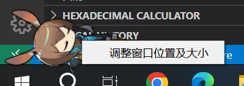

# 基于PyQt5和网页前端的桌宠程序

支持的模型文件格式：`.webm, .gif(尚未完成)`

默认模型取材于[prts.wiki.阿米娅](https://prts.wiki/w/%E9%98%BF%E7%B1%B3%E5%A8%85)

## 食用方法

**在运行前请先运行`steup.bat`，检查是否有正确安装`Python3.9`、`pip`以及一些第三方依赖库**

双击运行main.py，你会得到一只阿米娅

以及一个小图标

你可以左键戳一戳她

也可以右键调整透明背景窗口的大小

如果想退出桌宠，请右键小图标，再点击退出（备注：显示按钮暂时没有作用）

文件夹下的config.json可以设置一些初始化参数（~~参数说明现在懒得写了，以后再说~~）

你也可以通过[明日方舟wiki/干员一览](https://prts.wiki/w/%E5%B9%B2%E5%91%98%E4%B8%80%E8%A7%88)来下载其他现成的明日方舟干员模型。下载下来的模型只需要放入models文件夹中，然后把`config.json`中的`model/path`修改一下就可以了。或者你也可以自己制作一些模型，当然这需要一点技术（~~我暂时也不会~~）

**如果遇到bug，或有其他疑问，请联系我**
